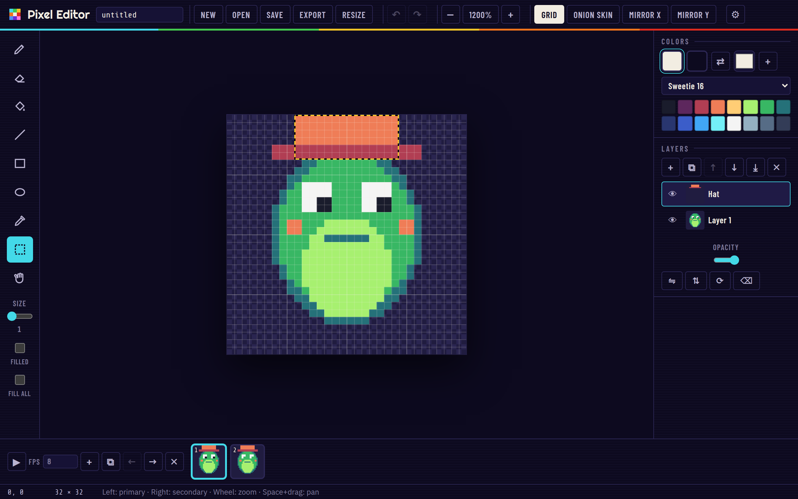
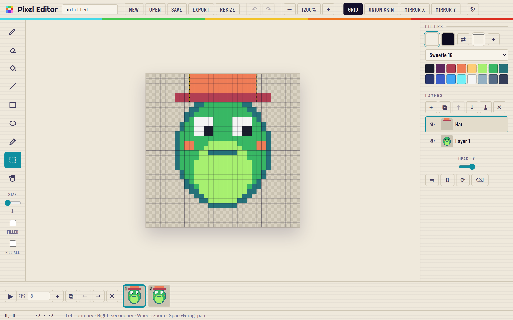

<h1 align="center">Pixel Editor</h1>

<p align="center">
  <b>A small, fast pixel-art editor in the browser.</b> Layers, animation frames, palettes, symmetry, PNG / sprite sheet / GIF export.
  No account, no server, works offline, installs as an app.
</p>

<p align="center">
  
</p>

**Live:** https://ardakalper.github.io/pixel-editor/

## Features

- **Tools:** pencil, eraser, bucket (contiguous or global), line, rectangle, ellipse (outline or filled), color picker,
  rectangular selection with move / copy / paste / delete, pan. Brush sizes 1–8. Left button paints the primary colour,
  right button the secondary.
- **Symmetry:** mirror across X, Y or both while you draw.
- **Layers:** add, duplicate, reorder, hide, opacity, merge down, flip, rotate, clear. Per-layer thumbnails.
- **Animation:** frames with duplicate / reorder / delete, onion skin, playback at any FPS, previous / next with `,` and `.`.
- **Palettes:** PICO-8, Sweetie 16, DawnBringer 16, Endesga 32, Game Boy, plus your own document palette. Keys `1`–`9` pick
  a swatch.
- **Export:** PNG at 1–16×, sprite sheet (frames in a row), animated GIF (own encoder, no dependencies), and a JSON project
  file you can reopen. Import PNG / GIF / WebP / JPEG or a project by opening, dropping or pasting.
- **Canvas:** new image up to 512×512, resize with an anchor, checkerboard, pixel grid with 8px majors, zoom 100%–6400%
  around the cursor, space + drag to pan.
- **Autosave** to the browser, unlimited-ish undo (80 steps), English and Turkish, dark and light themes, PWA.
- Plain HTML, CSS and ES modules. No build step, no runtime dependencies.

<p align="center">
  
</p>

## Keyboard

| Key | Action |
|---|---|
| `B` `E` `G` `L` `R` `O` `I` `M` `H` | Pencil, eraser, fill, line, rectangle, ellipse, picker, select, pan |
| `[` `]` | Brush size |
| `X` | Swap primary / secondary |
| `1`–`9` | Pick a palette colour |
| `Ctrl+Z` / `Ctrl+Y` | Undo / redo |
| `Ctrl+A` `Ctrl+C` `Ctrl+V` `Ctrl+D` `Delete` | Select all, copy, paste, deselect, clear selection |
| `Ctrl+S` | Download the project file |
| `+` `-` | Zoom |
| `Enter` `,` `.` | Play / stop, previous / next frame |
| Wheel, `Space`+drag, middle button | Zoom around the cursor, pan |

## Run it locally

```sh
git clone https://github.com/ardakalper/pixel-editor
cd pixel-editor
npm start            # serves app/ on http://localhost:4174
```

## Tests

```sh
npm install
npm run test:unit    # raster ops, document model, history, GIF encoder, i18n  (node --test)
npm run test:e2e     # Playwright: real mouse strokes on the canvas, layers, frames, exports, persistence
```

Set `PW_CHROMIUM_PATH=/path/to/chrome` to reuse an installed Chromium. CI runs both suites on every push and deploys
`app/` to GitHub Pages when `main` is green.

## How it is built

```
app/
  index.html         layout: toolbar, canvas viewport, colour and layer panels, timeline, dialogs
  css/app.css        tokens (dark / light), layout
  js/raster.js       pure pixel ops: stamps with symmetry, Bresenham lines, rects, ellipses, scanline flood fill,
                     compositing, region extract / blit, flip / rotate / resize / scale
  js/model.js        document = layers × frames, one cel per pair; serialize / deserialize; snapshots
  js/history.js      undo / redo over snapshots
  js/gif.js          GIF89a encoder with LZW, global palette and transparency (and a tiny decoder for tests)
  js/palettes.js     built-in palettes
  js/main.js         the UI: tools, rendering, selection, playback, export / import, shortcuts, persistence
  js/i18n.js         English and Turkish
tests/               node:test unit tests and Playwright e2e specs
tools/               static server, icon generator, screenshot script
```

The document is rendered to a canvas at its native size and scaled with CSS (`image-rendering: pixelated`); the grid,
onion skin, symmetry axes, shape previews and selection are drawn on a second canvas above it. Every edit takes a
snapshot first, so undo is a pointer swap.

## Credits

Fonts are bundled as subsetted woff2 files under the SIL Open Font License 1.1: Barlow Condensed, Share Tech Mono,
IBM Plex Sans and Righteous, from Google Fonts. Palettes by their respective authors (Lexaloffle, GrafxKid,
DawnBringer, Endesga).

## License

MIT.

---

### Türkçe özet

**Pixel Editor**, tarayıcıda çalışan küçük ve hızlı bir piksel sanat editörü. Kalem, silgi, kova, çizgi, dikdörtgen,
elips, renk seçici, seçim ve kaydırma araçları; X/Y ayna simetrisi; katmanlar (çoğalt, sırala, gizle, opaklık,
birleştir, çevir, döndür); animasyon kareleri, soğan zarı ve oynatma; hazır paletler; PNG, sprite sheet, animasyonlu GIF
ve proje dosyası olarak dışa aktarma; PNG ve proje dosyası içe aktarma. Tarayıcıya otomatik kaydeder, çevrimdışı
çalışır, uygulama olarak kurulur. Türkçe ve İngilizce, koyu tema varsayılan.
